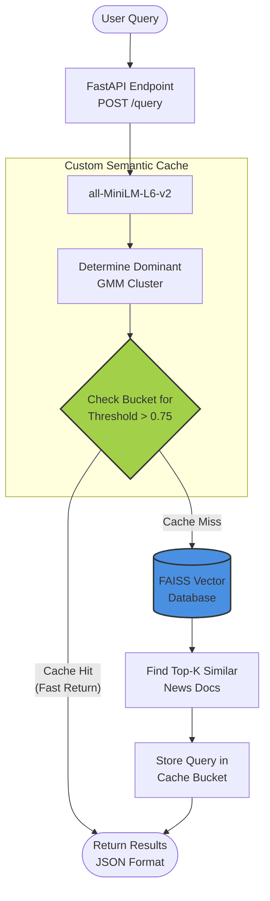

# Trademarkia AI/ML Engineer Task - Semantic Cache System 🚀
[](https://fastapi.tiangolo.com/)
[](https://www.python.org/)
[](https://www.docker.com/)

This repository contains a fully containerized, lightweight **Semantic Search system** built over the [20 Newsgroups Dataset](https://archive.ics.uci.edu/dataset/113/twenty+newsgroups). It implements a highly efficient, custom **memory-resident semantic cache** designed to detect when a rephrased natural language query has the exact same semantic intent as a previously computed one—eliminating redundant database lookups. 


*(Note: Visual of the interactive Swagger UI endpoints)*

---

##  Project Aim
Traditional exact-match caching systems break the second a user types `"What's the best motorcycle?"` instead of `"Which motorbike should I buy?"`. 

The aim of this project is to build a system from first principles (no Redis or Memcached) that understands **semantic intent**. By clustering the entire newsgroup corpus into fuzzy boundaries and leveraging a Vector Database (`FAISS`), the system can return highly relevant cached results in a fraction of the time by dynamically adjusting hit thresholds based on topic buckets.

---

##  Methodology & Architecture

The system avoids the standard $O(N)$ linear cache scan bottleneck by grouping past queries into $K$ distinct topic buckets. When a new query arrives, we only search for similar past queries inside its *dominant cluster bucket*, achieving sub-linear $\sim O(N/K)$ cache lookup times.

### The Three Core Pillars

#### 1. Embedding & Vector Storage
Raw text data is parsed, cleaned (stripping metadata like headers and quotes), and embedded into 384-dimensional dense vectors using HuggingFace's `all-MiniLM-L6-v2`. The vectors are stored in a **FAISS `IndexFlatIP`** (Inner Product), which provides extremely efficient exact Cosine Similarity matching for $L2$ normalized vectors.

#### 2. Fuzzy Clustering (GMM + PCA)
Instead of forcing hard labels, the system leverages a **Gaussian Mixture Model (GMM)** over PCA-reduced embeddings ($d=50$). This discovers 20 latent clusters in the data. Each document and query belongs to *multiple* clusters via a fuzzy probability distribution matrix.

#### 3. Custom Semantic Cache
The caching layer intercepts incoming queries:
1. Embeds the query.
2. Identifies the "Dominant Cluster".
3. Compares the new embedding against cached queries *within that same cluster*.
4. If the cosine similarity surpasses our tuned threshold ($0.75$), the exact match is instantly returned as a cache hit.

### System Diagram



---

## Getting Started

You can run this project either directly via Python or as a Docker container.

### Option 1: Using Python (Virtual Environment)
Ensure you have Python 3.9+ installed.

```bash
# 1. Clone the repository
git clone https://github.com/YourUsername/Trademarkia---AI-ML-Engineer-Task.git
cd Trademarkia---AI-ML-Engineer-Task

# 2. Setup environment and install dependencies
python3 -m venv venv
source venv/bin/activate  # On Windows: venv\Scripts\activate
pip install -r requirements.txt

# 3. Download the dataset and build the Vector DB (Run once)
python data_prep.py

# 4. Train the Fuzzy Clustering GMM Models (Run once)
python clustering.py

# 5. Start the FastAPI Server
uvicorn main:app --reload
```

### Option 2: Using Docker Compose
Ensure you have Docker and docker-compose installed.

```bash
docker-compose up --build
```
> *Note: Before running Docker, it's recommended to run `data_prep.py` and `clustering.py` locally first so the models are saved into the `/data` folder. Docker will mount this volume on boot to save download/training time.*

---

## 💻 API Endpoints & Usage

Once running, navigate to **[`http://localhost:8000/docs`](http://localhost:8000/docs)** to use the interactive Swagger UI.

### 1. Query System: `POST /query`
**Payload:**
```json
{
  "query": "Is funding for NASA going to be reduced next year?"
}
```
**Response (Cache Miss):** Computes results dynamically using FAISS.
**Response (Repeated or Reworded Query - Cache Hit):**
```json
{
  "query": "Will the space program budgets be cut?",
  "cache_hit": true,
  "matched_query": "Is funding for NASA going to be reduced next year?",
  "similarity_score": 0.824,
  "result": { ... },
  "dominant_cluster": 9
}
```

### 2. Check Cache Statistics: `GET /cache/stats`
Returns the status, size, and hit-rate of the memory-resident semantic cache.
```json
{
  "total_entries": 42,
  "hit_count": 17,
  "miss_count": 25,
  "hit_rate": 0.405
}
```

### 3. Flush Cache: `DELETE /cache`
Resets all internal buckets and metrics.

---

##  Testing the Pipeline
An automated test script is provided to verify the semantic retrieval logic and threshold tunings. 
Run it via another terminal window:
```bash
python test_api.py
```
This script queries the active node, forces a cache miss, tests a re-worded version of the same question to trigger an explicit cache hit, and returns the stats.

---
*Built as an assignment submission for the AI/ML Engineer Role at Trademarkia.*
